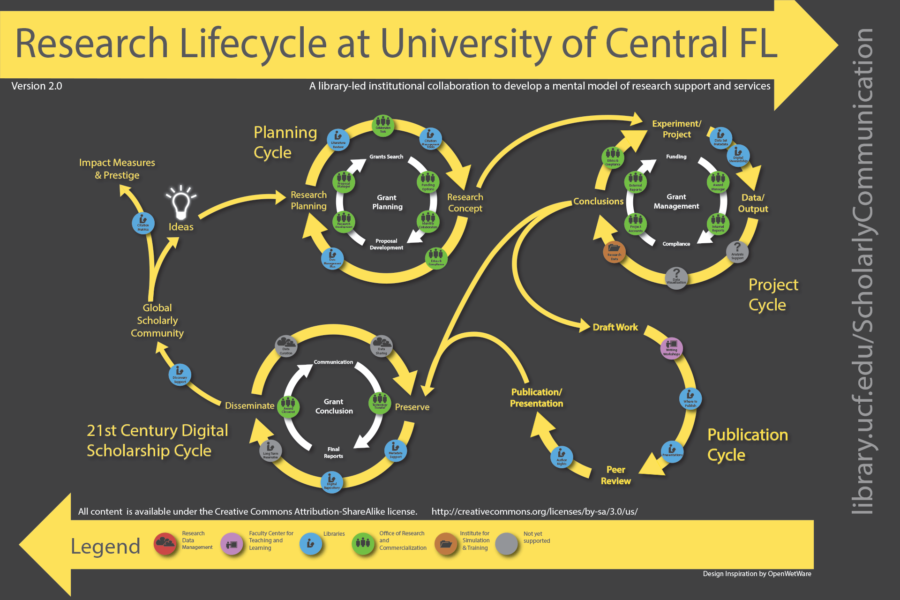

## Description

The first module of the training is an introduction of the Open Science environment to SSH researchers. This module has four learning outcomes.

- Describe the current policy landscape that shapes knowledge production and the way it affects the SSH Research Framework
- Identify SSH practices in Open Science
- Recognise SSH specificities within the research workflow during knowledge production from an ethical, legal and methodological perspective.
- Describe  what the research data management requirements and standards are

In this sub-module we will discuss SSH in the research life cycle and we are going to look at:

- Research life cycle as a concept
- Data life cycle
- ELSI

## Learning resources

- [Presentation slides](https://docs.google.com/presentation/d/1dxOZ5YM0WKQAkx4-JbvA4Q6zEb6n8STo/edit?usp=sharing&ouid=102604071504748959042&rtpof=true&sd=true)
## Research Lifecycle Frameworks

There are numerous frameworks of research lifecycles with similar key stages like planning, project execution, and dissemination of results, tailored by different institutions in accordance with their operations.

Image from: [https://library.ucf.edu/about/departments/scholarly-communication/overview-research-lifecycle/](https://library.ucf.edu/about/departments/scholarly-communication/overview-research-lifecycle/) - [CC BY-SA 3.0](https://creativecommons.org/licenses/by-sa/3.0/deed.en)

### Research Data Management Lifecycle

Research data garners a lot of attention as it is one of the most crucial components of the research puzzle. Of course analysis and reports, and outcomes are the fundamental to why we do research, but the essence, and the further understanding of how we reach a conclusion or an outcome, should be based on the accumulation of data and research materials during the analysis process.

 
Image fromCioffi, M., Goldman, J., & Marchese, S. (2023). Harvard Biomedical Research Data Lifecycle (Version 5). Zenodo. [https://doi.org/10.5281/zenodo.8076168](https://doi.org/10.5281/zenodo.8076168)

[CC BY-NC 4.0](https://creativecommons.org/licenses/by-nc/4.0/legalcode)

### References

For in-text references (or actual source acknowledgement if an article is fully/mainly retrieved from an external resource - please note the copyright holder and terms of reuse - if we can’t make the article CC BY, then don’t use the source!). 

### Further reading

Search for relevant resources available in English or other if you know the language

### Related Skills4EOSC Training Materials (Teachers/Learners)

Connect the material with related pedagogical support and exercises if it is the case. - Connect if there are other material - talks about OS Pillars  

