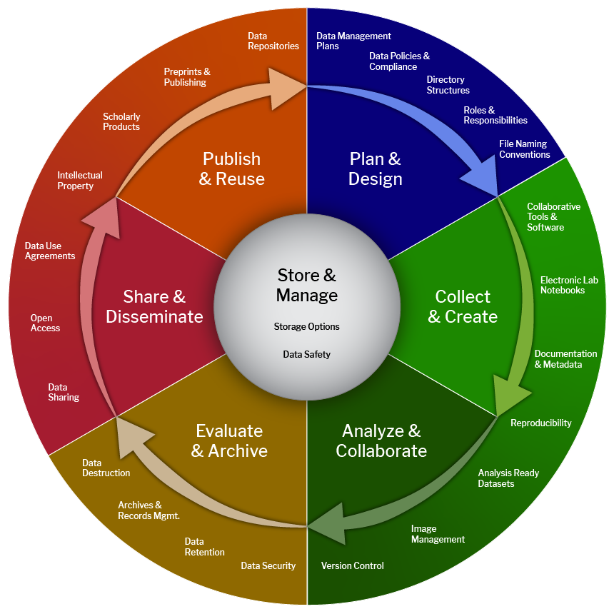

## Description

In this unit you will learn to: 

- Write learning outcomes 
- Design a learning path

## Learning resources

- [Presentation slides](https://docs.google.com/presentation/d/1KBjnwBxVxOGVqAWqf3CDHGrWzX8olz_6AEluJ6QnDmg/edit#slide=id.g1f303595554_0_136)
- [Learning outcomes table](https://docs.google.com/spreadsheets/d/1vfa30wNSJz7YtmEdzQOS9UfUHT3u7a77jIRgoP1MS4I/edit?gid=0#gid=0)
- [Activities](https://docs.google.com/document/d/1zRpsykCrJ9tT9IVcjYSyS2lXYV3RVXpfMOubTxl6-t8/edit#heading=h.px2yjw16k40o)

### Backward design

#### Identifying the desired outcomes

It goes without saying that when we identify the desired outcomes, we have already clearly identified our target audience. This training is aimed at researchers in the social sciences and humanities (SSH) at different stages of their careers.

The desired outcomes for learners are directly linked to the needs in terms of knowledge, skills and competences that they need to acquire or develop. There are different ways of identifying such needs. We can carry out surveys or have direct discussions with the community targeted by the training. We can carry out gap analyses and job analyses. We can refer to government policies and standards or skills and competence frameworks, etc.

To identify the desired outcomes of this training for SSH researchers, the starting point was the [Catalogue of Open Science Career Profiles](https://zenodo.org/records/8101903) (or Minimum Viable Skillset), which is one of the outcomes of the Skills4EOSC project. The Minimum Viable Skillset (MVS) describes the essential skills and concepts required to deliver open science outcomes for communities and organisations" (Whyte et al. 2023). 

Based on available resources, such as relevant competency frameworks and reports describing gaps and needs related to the practice of Open Science, each MVS identifies and summarises, for a particular role, the essential skills and competencies that the role may require.  

"An MVS is linked to a profile that provides additional context by describing the OS mission and outcomes typically expected from the role, the activities involved in contributing to those outcomes, and the level of proficiency required for each of the essential skills. While each MVS is role-specific, the roles are described at a broad level to allow for alternative titles, for example for 'data professional' roles that have a similar mission for open science' (Whyte et al. 2023).

The MVS catalogue is therefore a useful guide for different stakeholders, including trainers when planning courses or developing curricula, searching for learning resources, or identifying the scope of further learning resources that may need to be developed.

Figure 1. Definition of Minimal Viable Skillset

As this training targets researchers, it is based on two MVS: early career researchers and senior researchers. The competences and skills listed in these two skillsets are summarised in Figures 2 and 3 below.

**

Figure 2. List of skills and competences for early career researchers, summarised from Whyte et al. 2023.

**

Figure 3. List of skills and competences for senior researchers, summarised from Whyte et al. 2023.

In this training, we do not specify the proficiency level. For this reason, we used both MVS for researchers indistinctly. The MVSs, as stated before, are rather broad, and produced a more specific one focused on SSH researchers’ needs. These competences and skills can be further adapted to different disciplines and domains.

### Minimal Viable Skillset for Social Sciences and Humanities researchers

- Knowledge of SSH policies, capabilities and OS practices.
- Ability to recognise SSH specific OS principles and identify relevant practices at each stage of the research workflow.
- Knowledge of the research and data lifecycle for the SSH
- Ability to make OS-compliant decisions for collecting, annotating and documenting data and software, creating metadata, using relevant taxonomies and preserving data (using existing repositories). 
- Adequate ability to implement SSH specific FAIR principles. 
- Ability to assess the FAIRness of existing resources 
- Writing a basic DMP to understand data management at the start of the project
- Ability to apply open publication practices, such as publishing preprints, publishing in open access journals and platforms, ensuring data and code are available in open repositories where possible.
## Learning Outcomes

Learning outcomes (LO), also known as learning objectives, are brief statements that describe the knowledge, skills or attitudes learners should be able demonstrate by the end of a training programme, course or session. 

- Attitude: change how learners act
- Skills: change how learners do things
- Knowledge: increase what learners know

We share learning outcomes with learners for them to have a better overview of the training programme and to understand what are the possibilities of integration and applications of the knowledge and skills they will acquire.

Writing learning outcomes allows trainers to articulate how learners will use the content of course and learning material instead of focusing on covering the content of the training.  In other words, learning outcomes state the  expected learner performance and not the trainer's intended instruction.

##### Characteristics of well written learning outcomes:

Learning outcomes should be specific and well defined: explain in clear and concise terms the specific skills learners should be able to demonstrate, produce, and know as a result of the course. This includes avoiding jargon and relying on active verbs in the future tense. Learning outcomes should be simple and not compound: avoid the use of bundled or compound statements that join the elements of two or more outcomes into one statement.

One way to ensure this is by completing the sentence:

‘By the end of the training students will be able to …’

[Bloom’s Taxonomy](https://fair-by-design-methodology.github.io/FAIR-by-Design_ToT/latest/Stage%201%20%E2%80%93%20Prepare/02-Preparing%20FAIR%20Learning%20Objects/02-Preparing%20FAIR%20Learning%20Objects_cont/) can be very helpful to help trainers to find the write verb for each learning outcome. 

1. Learning outcomes should be measurable: rely on the use of specific, active and observable verbs to indicate how learning will be assessed. Well written learning outcomes prepare the learners for assessment and help them feel engaged in and empowered by the training process.
2. Learning outcomes should be applicable: reflect and indicate the  ways in which the learner is likely to use and integrate the acquired knowledge and skills in the future.
3. Learning outcomes should be realistic: make sure that outcomes are attainable. Outcomes need to be reviewed in light of learners’ ability, developmental levels, their initial skill sets, and the time available to attain these skill sets.
4. Learning outcomes should be time-bound: offer a timeline by which the desired  knowledge or skills should be acquired.

  

Figure 4. Characteristics of a learning outcome

## Learning path

By analysing the MVS for SSH researchers, we identified that all the knowledge and skills are related to the phases of the research lifecycle, as the one represented in the Figure below.

Figure 5. Research Data Lifecycle from Cioffi, M., Goldman, J., & Marchese, S. (2023).. Zenodo. [https://doi.org/10.5281/zenodo.8076168](https://doi.org/10.5281/zenodo.8076168),  [CC BY-NC 4.0](https://creativecommons.org/licenses/by-nc/4.0/legalcode)

However, writing learning outcomes not only guides assessment and evaluation but it also helps to prioritise key learning points whether for each session or for the whole course. As this training focuses on SSH researchers in general, i.e., without looking to the specificities of each discipline, we created a simpler version of the research lifecycle, one that includes three phases: planning research, active research, and dissemination and preservation of research.

Figure 6. The three phases of the research lifecycle

A learning path is a route that learners take in a training program. It puts together a selection of bricks and transforms them into a cohesive learning journey, while breaking the whole  process into manageable chunks. A learning path is a roadmap that takes learners from point A to point B. The research lifecycle is the representation of our learning path.

Each of the three phases of the lifecycle became the focus of a module of the training. It is noteworthy that, as it is a cycle, it starts and ends in the same place, planning research. At this phase it is crucial to be able to assess the quality and FAIRness of resources and to know to reuse them. However, this topic is addressed during Module 3 for simplicity sake.

The images below depict the road that goes from the MVS to the learning path.

Figure 7. From the competences and skills to the desired learning outcomes in module 1 of the training.

Figure 8. From the competences and skills to the desired learning outcomes in Module 2 of the training.

Figure 9. From the competences and skills to the desired learning outcomes in Module 3 of the training.

These competences and skills can be developed through more learning outcomes. In other words, this training can be modified and tailored to more specific needs, whether these needs are related to the different SSH disciplines, the levels of proficiency, among other reasons. 

To summarise, to design a learning path we need to:
- Define the target audience (level, discipline)
	- SSH researchers 
- Define the content and how to deliver it (face-to-face, online, self-paced, hybrid training, etc.)
	- Training of Trainers
- Decide the level of granularity
	- Introductory, addressing the research phase through general terms and concepts
- Identify the learning outcomes
	- Listed above
- Prioritise and organise the learning outcomes 
	- Modules corresponding to the phases
  

### References

Wiggins, G., & McTighe, J. (2005). Understanding by design (2nd ed.). Alexandria, VA: Association for Supervision and Curriculum Development ASCD.
### Further reading

More about [Backward Design](https://fair-by-design-methodology.github.io/FAIR-by-Design_ToT/latest/Stage%201%20%E2%80%93%20Prepare/02-Preparing%20FAIR%20Learning%20Objects/02-Preparing%20FAIR%20Learning%20Objects_cont/) in the FAIR-by-Design Train of Trainers.

Dávila, A. (2017). Wiggins, G., & McTighe, J. (2005) Understanding by design (2nd ed.). Alexandria, VA: Association for Supervision and Curriculum Development ASCD. Colomb. Appl. Linguist. J., 19(1), pp. 140-142. 

Where to Start: Backward Design | Teaching + Learning Lab. (n.d.). Retrieved July 12, 2024, from [https://tll.mit.edu/teaching-resources/course-design/where-to-start-backward-design/](https://tll.mit.edu/teaching-resources/course-design/where-to-start-backward-design/) 

Button, L. (2021). Backward Design Process as a Curriculum Development Model. [https://oer.pressbooks.pub/curriculumessentials/chapter/chapter-backward-design-process-as-a-curriculum-development-model/](https://oer.pressbooks.pub/curriculumessentials/chapter/chapter-backward-design-process-as-a-curriculum-development-model/) 

Video:  [Grant Wiggins - Understanding by Design (Part 1 of 2)](https://www.youtube.com/watch?v=4isSHf3SBuQ)

Video: [Grant Wiggins - Understanding by Design (Part 2 of 2)](https://www.youtube.com/watch?v=vgNODvvsgxM)**
